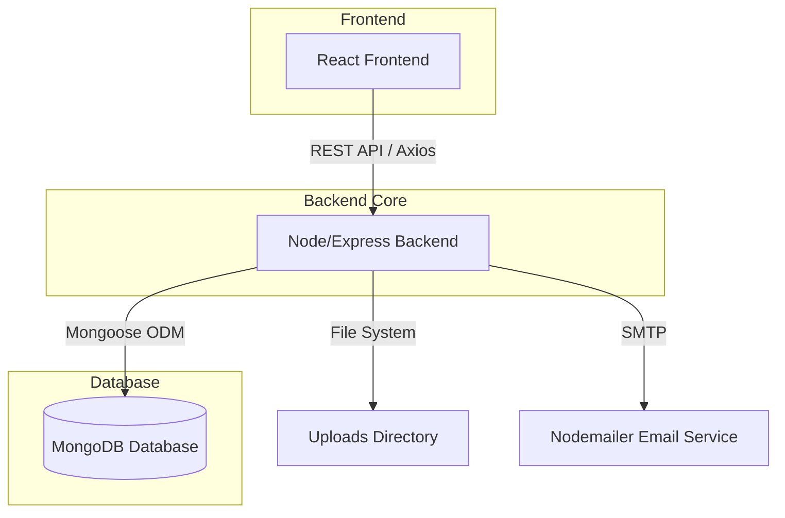

# 🎓 CampusConnect - College Placement Management System

## 📌 Project Overview
CampusConnect is a comprehensive College Placement Management System built to streamline the recruitment process for students, placement officers, and company recruiters. The platform solves the traditional, manual placement tracking problem by providing a centralized dashboard where students can build profiles and apply for jobs, recruiters can manage applicants, and admins can oversee the entire placement drive, view analytics, and generate reports.

## ✨ Key Features

### 👨🎓 Student Module
- **Profile Management:** Students can update their academic details including CGPA, backlogs, department, and technical skills.
- **Resume Upload & AI Parsing (Mock):** Upload resumes (PDF/Doc) with an implemented mock AI parser that automatically extracts keywords and skills.
- **Job Applications:** Browse available companies and apply for roles. The system automatically checks student eligibility (CGPA, backlogs, branch) before allowing an application.
- **Application Tracking:** Track the real-time status of applied jobs (e.g., Shortlisted, Selected).

### 👨💼 Admin / Placement Officer Module
- **Analytics Dashboard:** Visual insights into total students, placed students, highest package, and detailed branch-wise & company-wise placement statistics.
- **Student Management:** Bulk import students via email, view individual student profiles, and export the complete student dataset to Excel.
- **Company Management:** Full CRUD operations to create, update, and manage company profiles, job roles, CTC, and specific eligibility criteria.
- **Application Oversight:** View all applications across all companies and track overall placement progress.

### 🏢 Recruiter (HR) Module
- **Applicant Tracking:** View the list of students who have applied specifically to their company.
- **Status Updates:** Update the application status of candidates (e.g., Shortlist, Select, Reject).
- **Automated Email Notifications:** When a candidate's status is updated to "Shortlisted" or "Selected," the system automatically sends an email notification to the student using Nodemailer.

### 🤖 AI Features (Partial Implementation)
- **Frontend UI Integration:** A dedicated UI section for AI Power Tools including a Smart Resume Analyzer, Placement Probability Prediction, and Job Recommendations.
- **Mock AI Processing:** The backend currently utilizes a mock AI parsing algorithm during resume upload to extract skills (React, Node.js, MongoDB) and generate confidence scores, preparing the architecture for seamless integration with real NLP/ML models in the `ml/` directory.

## 🖼️ Screenshots
*(Add screenshots here by replacing the placeholder links)*

- 
- 
- 

## 🛠️ Tech Stack

**Frontend:**
- **Framework:** React 18 with Vite
- **Styling:** Tailwind CSS
- **Libraries:** Framer Motion (Animations), Recharts (Analytics Charts), Lucide React (Icons)
- **State/Routing:** React Router DOM, Context API
- **HTTP Client:** Axios

**Backend:**
- **Runtime:** Node.js
- **Framework:** Express.js
- **Authentication:** JSON Web Token (JWT) & bcryptjs
- **File Handling:** Multer (Resume uploads)
- **Utilities:** ExcelJS (Exporting data), Nodemailer (Automated emails)

**Database:**
- **Database:** MongoDB
- **ODM:** Mongoose

**Deployment:**
- **Frontend Hosting:** Vercel (Configured via `vercel.json`)

## 🏗️ System Architecture

**Architecture Flow:**



## ⚙️ How It Works

1. **User Authentication:** Students, HRs, and Admins log in through a unified authentication gateway. JWT tokens are issued and stored in the client.
2. **Data Interaction:** The user interacts with the React frontend (e.g., a student applies for a job).
3. **API Request:** The frontend sends an Axios HTTP request to the Express backend.
4. **Backend Processing:** 
    - Middleware verifies the JWT token.
    - Controller logic validates eligibility (e.g., checking CGPA vs Company Criteria).
    - Database operations (create application) are executed via Mongoose.
5. **Post-Processing:** If an HR selects a student, the controller triggers Nodemailer to send an automated status email.
6. **Response:** The backend returns a JSON response, and the frontend state updates to reflect the new data instantly.

## 📂 Project Structure

```
College-Placement-Management/
├── frontend/                 # React frontend application
│   ├── src/
│   │   ├── components/       # Reusable UI components
│   │   ├── context/          # React Context for global state (Auth)
│   │   ├── pages/            # Page-level components (Dashboards, Login)
│   │   └── services/         # API integration layers
│   ├── package.json
│   ├── vercel.json           # Vercel deployment configuration
│   └── vite.config.js
├── backend/                  # Node.js Express backend API
│   ├── config/               # Database connection setup
│   ├── controllers/          # Request handling logic (Admin, Auth, Student, etc.)
│   ├── middleware/           # JWT and Role-based access verification
│   ├── models/               # Mongoose schemas (Student, Company, Application)
│   ├── routes/               # API route definitions
│   ├── uploads/              # Local storage for student resumes
│   ├── utils/                # Helper functions (Nodemailer, ExcelJS)
│   ├── package.json
│   └── server.js             # Main application entry point
└── ml/                       # Python machine learning models (Planned)
```
